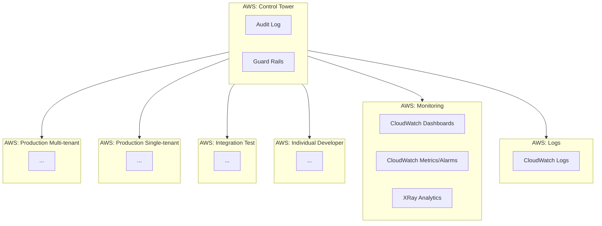
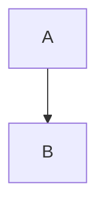

# Governance and setup
Goals: Low cost, high flexibility, modular approach to infrastructure pieces.

- Mermaid diagram
- Control Tower and audit trail
- Billing alerts and tags

Let's first sketch out the Account Governance structure, before diving into the view of each individual AWS account:

- **Control Tower**: This is your central place to control access and policies for all accounts in your organization
- **Production Multi-tenant**: Your primary production account for multi-tenant setup, and most likely were the majority of users will be
- **Production Single-tenant**: While desirable to avoid the operation overhead for single-tenant setups, its good to think in this from the get-go
- **Integration Test**: This will be the account that IaC deployments get tested on to ensure rollout works
- **Individual Developer**: Individual developer accounts to allow easy testing of IaC testing and exploration
- **Monitoring**: Centralize monitoring and observability into one account, allowing access to insights without access to sensitive logs or infrastructure from the other accounts
- **Logs**: Centralized storage of logs, which may require different access considerations than metrics and traces

# Deployment and CI
- AWS CDK
    - Speed up https://pgrzesik.com/posts/speed-up-cdk-deploments/
    - CDK Watch https://aws.amazon.com/blogs/developer/increasing-development-speed-with-cdk-watch/
- Deployments
    - Canary environment
    - Dev environments?
    - Canary deployment and rollback
    - Blue/green?
- CI
    - Build
    - Deploy to integration
    - Check
    - Deploy canary to production
    - Check canary specifically?

# Database
- DynamoDB
- Aurora Serverless v2?
    - Not fully serverless

# Frontend: Web and Mobile
- S3 + CloudFront
  - Tiny Leptos todo app as example
- Mobile build
  - PWA?
    - https://web.dev/learn/pwa/getting-started/
    - https://firt.dev/notes/pwa-ios/
    - http://pwabuilder.com
    - Notifications are coming https://webkit.org/blog/12945/meet-web-push/
    - https://medium.com/@firt/whats-new-on-ios-12-2-for-progressive-web-apps-75c348f8e945
    - Doesn't really seem ideal
  - Capacitor?
    - https://capacitorjs.com

# Backend: API and Services
- API Gateway + Lambda
    - CloudFront in front for better traffic price
    - Federated schema + two services
- WAF

# Queues and Pub/Sub
- SQS
- SES + SNS
- Pub/sub setup, SNS vs EventBridge
  - https://www.altostra.com/blog/aws-pub-sub
  - https://aws.amazon.com/pub-sub-messaging/
- ETL setup? Fargate? Analytics

# Internal Applications
- Access control? SSO? Cognito?

# Local development
- Stitching all the pieces together
- Frontend against deployed backend
- Frontend against local backend
- Backend against deployed database
- Backend against local database
- SQS locally?
- Pub/Sub locally?

# Pull Request development
- Preview Environments for PRs
- Run local Frontend + Backend against Deployed?
- SQS and Pub/Sub?

# Monitoring and observability
- Xray
  - Cross-account
    - https://docs.aws.amazon.com/xray/latest/devguide/xray-console-crossaccount.html
    - https://aws.amazon.com/about-aws/whats-new/2022/11/amazon-cloudwatch-cross-account-observability-multiple-aws-accounts/
- CloudWatch Dashboards
